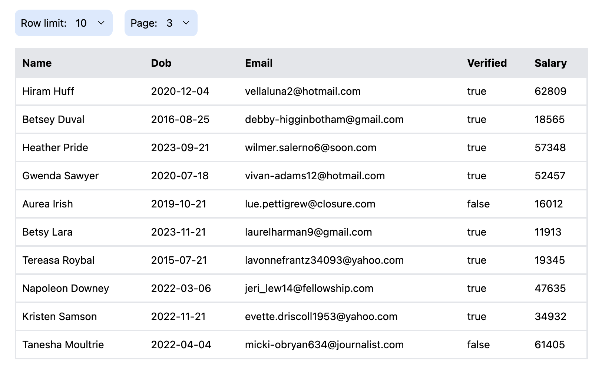

# Conduktor Technical Assignment

## Getting started

1. If you use [nvm](https://github.com/nvm-sh/nvm) to manage node versions, please run `nvm use` in the root of this project. Otherwise, the project uses `v22.13.0` of [Node.js](https://nodejs.org/en/about/previous-releases).

1. `npm install` to download dependencies

1. `npm run start` to start the development server

The Vite server will start on http://localhost:5173 by default. Open in a web browser to view the page.

You should see the following screen:

